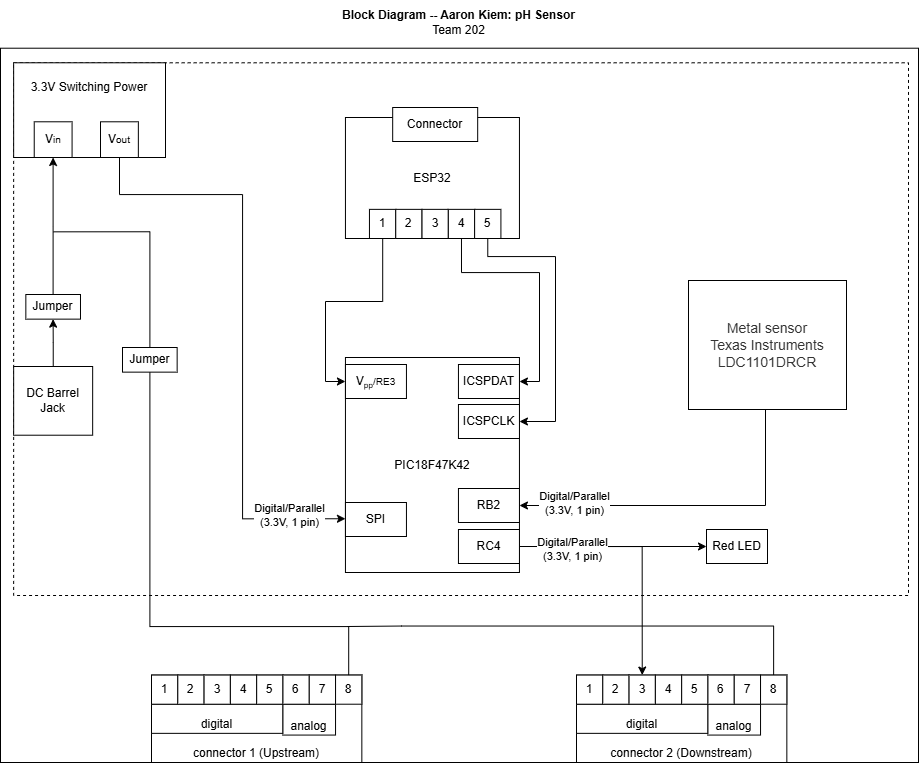

## Overview
This section depicts my individual block diagram which is of a metal detection system in which utalizes the LDC1101DRCR metal sensor from Texas Industries. The purpose of a block diagram is to be able to visualize and organize a system that will be able to connect with adjacent team members. Some features of the block diagram includes:

* power levels - 3.3V
* sensor - Metal Detection
* Actuator - Red LED
* team connections - Downstream
* Power source - Plug-in system

## Block Diagram 

## Design Process
Using a PIC microcontroller, I have connected a barrel jack and jumpers to my system so that I can choose to take in either the barrel jack power suopply or an external supply shared by the team. The LED acts as an actuator to ensure that my system is able to handle the outputs of the sensor. But because the PIC is a surface mount device, the SNAP programmer is used to encode the PIC. On the 8 pin connection, pin 1 is the shared unregulated power, pin 8 is a shared ground, and the pin 2 is the RX and TX that is linked to a neighboring subsystem. The overall diagram ensures that the microcontroller is powered and can be programmed and works with the sensor to be ready to sent information down the daisy chain.