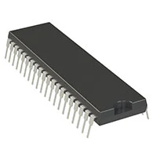

## Module's Selected Major Components

The following sections are the selected major components necessary for  .....

>**For each of the following sections, use <ins>one of the two styles</ins> given near the end. *REMOVE THIS NOTE***

### Power Management

(**remove this note/placeholder**: this is where your 3.3 volt switching regulator, any other needed power regulator, and power source {if applicable} **THAT WERE SELECTED**)

For more details, review the ["Appendix - Component Selection Process - Power Mangement"](https://embedded-systems-design.github.io/EGR314DataSheetTemplate/Appendix/01-Componet-Selection/Component-Selection-Process/#power-management) selection.

### Sensor

| **Solution**                                                                                                                                                                                      | **Pros**                                                                                                                                    | **Cons**                                                                                            |
| ------------------------------------------------------------------------------------------------------------------------------------------------------------------------------------------------- | ------------------------------------------------------------------------------------------------------------------------------------------- | -------------------------------------------------------
|
 Option 3.  LDC1101DRCR $4/each   [Link to product](https://https://www.digikey.com/en/products/detail/texas-instruments/LDC1101DRCR/8347716) | \* Measures both inductance and proximity profiling path  \* Higher speeds and resolution than the JDC1614  |  \* Sensor coil must be designed  \* SPI programming required  \* More complex to implement    |

For more details, review the ["Appendix - Component Selection Process - Sensor"](https://embedded-systems-design.github.io/EGR314DataSheetTemplate/Appendix/01-Componet-Selection/Component-Selection-Process/#sensor) selection.

## Microcontroller 

| **Microcontroller**                                                                                                                                                                                      | **SPI, UART, I2C**                                                                                                                                    | **Pins count**                                                                                            |
| ------------------------------------------------------------------------------------------------------------------------------------------------------------------------------------------------- | ------------------------------------------------------------------------------------------------------------------------------------------- | -------------------------------------------------------
|
 Option 1.  PIC18F47Q10 $3/each   [Link to product](https://www.digikey.com/en/products/detail/microchip-technology/PIC18F47Q10-I-P/10187785) | \* 4-wire SPI  \* (CSB, SCLK, SDI, SDO)  |  \* 11 Pins, 3.3V system |

My subsystem is of a metal detector system for the CropScout rover design. I am responsible for detecting earth metals underground and will provide an LED actuator. The system will be able to run on 3.3V