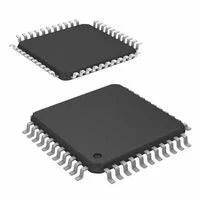

## Module's Selected Major Components

The following sections are the selected major components necessary for  .....

### Power Management

| **Solution**                                                                                                                                                                                      | **Pros**                                                                                                                                    | **Cons**                                                                                            |
| ------------------------------------------------------------------------------------------------------------------------------------------------------------------------------------------------- | ------------------------------------------------------------------------------------------------------------------------------------------- | -------------------------------------------------------
 Option 2.   AP63203WU-7  $1/each [Link to product](https://www.digikey.com/en/products/detail/diodes-incorporated/AP63203WU-7/9858426?s=N4IgTCBcDaIIIAUBsBmMAGFB1AqgWgHYQBdAXyA) | \* Smaller component  \* Low Cost   \* Input 4-32V output 3.3V | \* Requires multiple parts  \* Single output    |

**Choice:** Option 2: AP63203WU-7

**Rationale:** The AP63203WU-7 is cheaper and is just as complex as the LM2575D2T, but with a much more balenced layout making it much easier to hand solder.

For more details, review the ["Appendix - Component Selection Process - Power Mangement"](https://aaronkiem.github.io/Appendix/01-Componet-Selection/Component-Selection-Process/) selection.

### Sensor

| **Solution**                                                                                                                                                                                      | **Pros**                                                                                                                                    | **Cons**                                                                                            |
| ------------------------------------------------------------------------------------------------------------------------------------------------------------------------------------------------- | ------------------------------------------------------------------------------------------------------------------------------------------- | -------------------------------------------------------
 Option 3.  LDC1101DRCR $4/each   [Link to product](https://www.digikey.com/en/products/detail/texas-instruments/ldc1101drcr/5320160) | \* Measures both inductance and proximity profiling path  \* Higher speeds and resolution than the JDC1614  |  \* Sensor coil must be designed  \* SPI programming required  \* More complex to implement    |

**Choice:** Option 3: LDC1101DRCR

**Rationale:** Despite being more complicated than the JDC1614RGHR, both would require a custom coil design and a PCB layout to apply which would require research to use either parts. Additionally, the LDC1101DRCR has higher processing abilities and an available datasheet.

For more details, review the ["Appendix - Component Selection Process - Sensor"](https://aaronkiem.github.io/Appendix/01-Componet-Selection/Component-Selection-Process/) selection.

## Microcontroller 

* PIC18F47Q10

For more details, review the ["Appendix - Component Selection Process - Table for the PIC"](https://aaronkiem.github.io/Appendix/02-Microcontroller-Selection/pic-table/) selection.