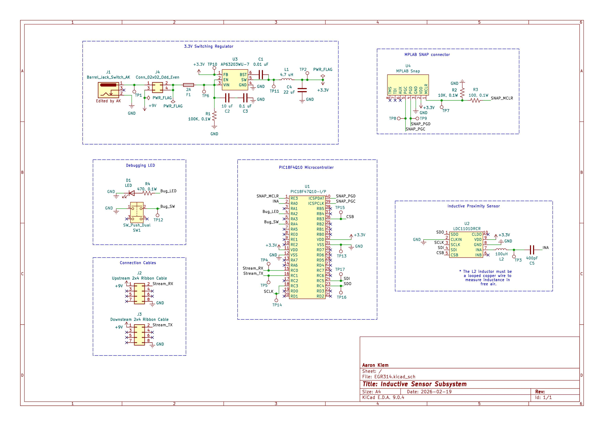

## Overview

This schematic is design to support a system acting as a metal detector using a LDC1101DRCR inductive proximity sensor powered with 3.3V from a AP63203WU-7 buck switching regulator. The system is controlled using a PIC18F4Q10 Microcontroller with an MPLAB SNAP programmer.

{style width:"350" height:"300;"}
**Figure #1:** Inductive Sensor Subsystem.

## Resouces

The schematic as a PDF download is available [*here*](EGR314.pdf)

The Zip folder of the project is available [*here*](EGR314.zip).

The symbol Library for KiCad is available [*here*](EGR314_Symbols.pdf)