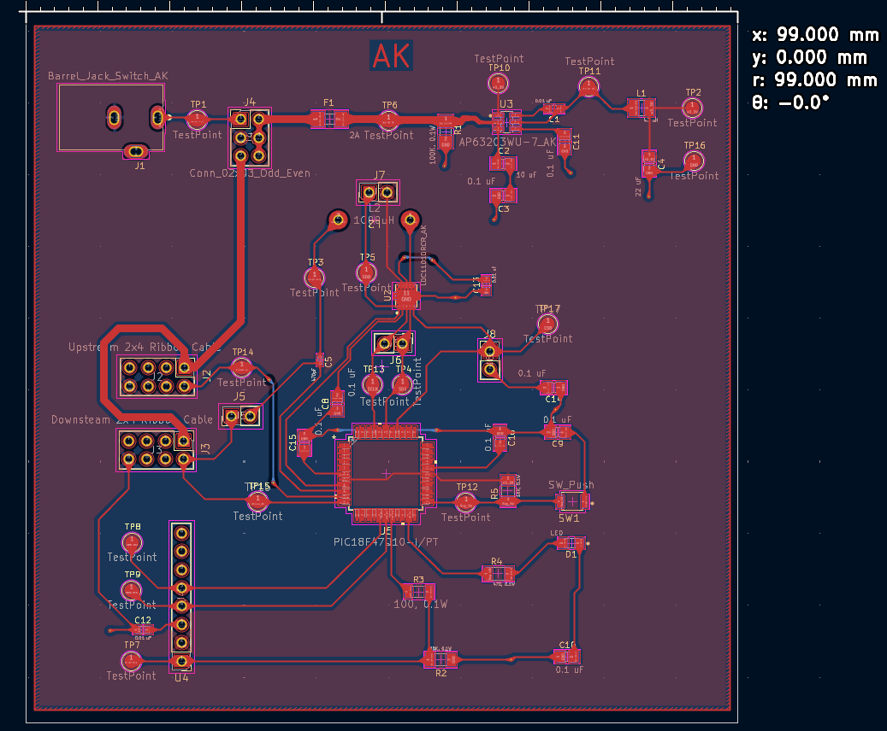
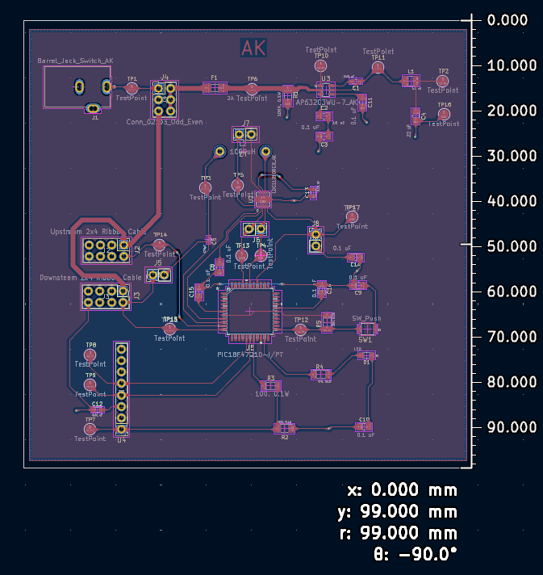
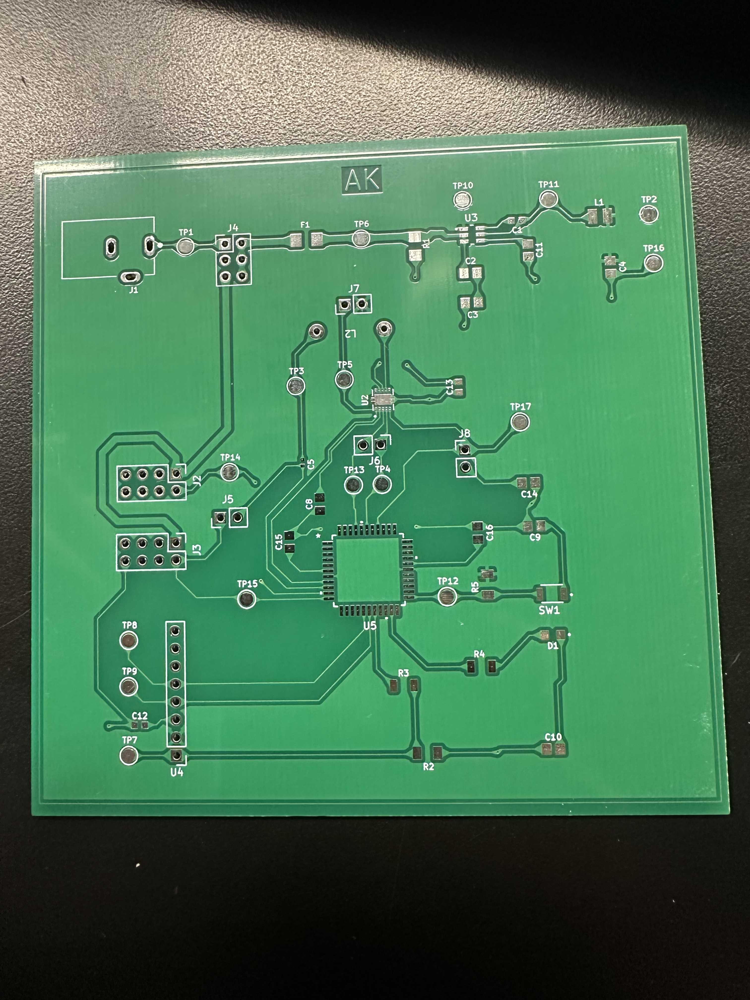
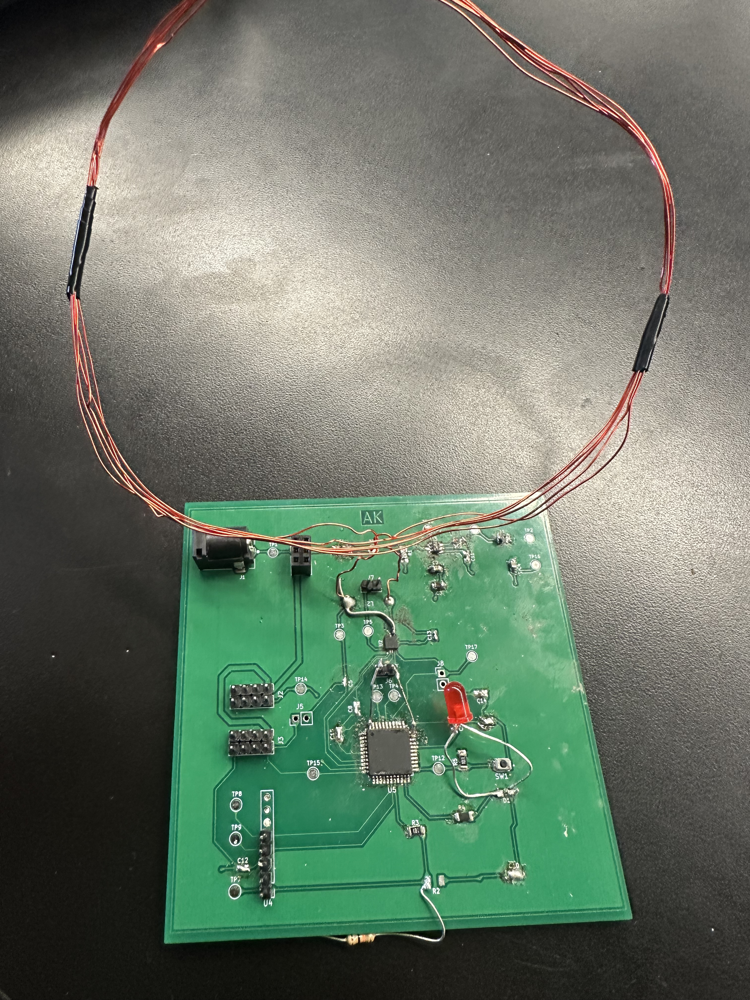
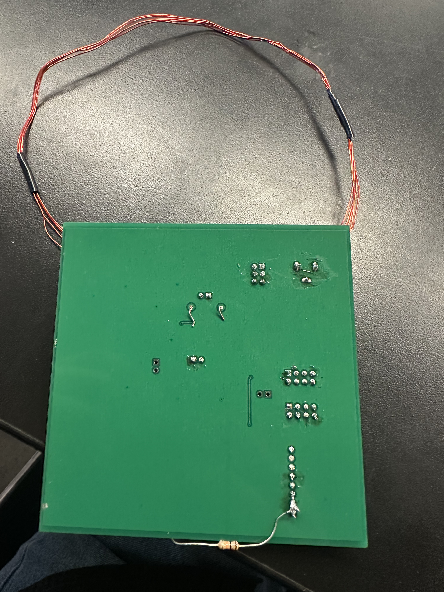

## Overview
This section is an overview of the PCB design for the Metal detection system for the CropScout.

{style width:"350" height:"300;"}

**Figure #1:** Front View of PCB.

{style width:"350" height:"300;"}

**Figure #2:** Back View of PCB.

{style width:"350" height:"300;"}

**Figure #3:** Blank PCB Layout

{style width:"350" height:"300;"}

**Figure #4:** Final Front PCB

{style width:"350" height:"300;"}

**Figure #5:** Final Back PCB

The zip folder of the project [*here*](EGR314.zip).

The footprint Library for KiCad [*here*](EGR314_Footprints.zip)

The Gerber zip folder [*here*](EGR314Gerber.zip).

The Front view PDF File [*here*](Front.pdf).

The Back view PDF File [*here*](Back.pdf).