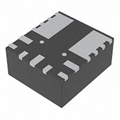
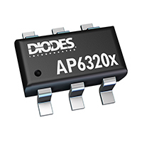
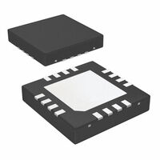
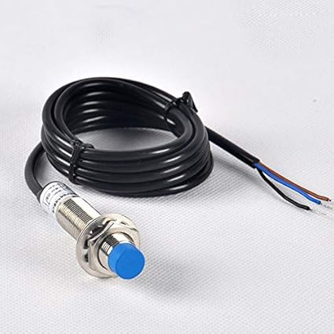
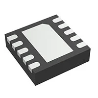

## Module's Major Components Selection Process

### Power Management

| **Solution**                                                                                                                                                                                      | **Pros**                                                                                                                                    | **Cons**                                                                                            |
| ------------------------------------------------------------------------------------------------------------------------------------------------------------------------------------------------- | ------------------------------------------------------------------------------------------------------------------------------------------- | -------------------------------------------------------
|
|  Option 1.  TPSM84209RKHR $5/each [link to product](https://www.digikey.com/en/products/detail/texas-instruments/TPSM84209RKHR/10273205?s=N4IgTCBcDaICoAUDKBZAHAFjABgJwCUBpACXxAF0BfIA)                 | \* Input 4.5-28V  \* Fixed 3.3/5V output  \* 2A output  \*  | \* Requires 2-3 external capcitors |
 Option 2.   AP63203WU-7  $1/each [Link to product](AP63203WU-7) | \* Smaller component  \* Low Cost   \* Input 4-32V output 3.3V | \* Requires multiple parts  \* Single output    | 
 Option 3.  LM2575D2T $2.50/each   [Link to product](https://www.digikey.com/en/products/detail/onsemi/LM2575D2T-3-3R4G/1476688) | \* Robust  \* Simple design  |  \* Requires multiple parts  \* Takes up greater space  |

**Choice:** Option 2: AP63203WU-7

**Rationale:** The AP63203WU-7 is cheaper and is just as complex as the LM2575D2T, but with a much more balenced layout making it much easier to hand solder.

### Sensor
| **Solution**                                                                                                                                                                                      | **Pros**                                                                                                                                    | **Cons**                                                                                            |
| ------------------------------------------------------------------------------------------------------------------------------------------------------------------------------------------------- | ------------------------------------------------------------------------------------------------------------------------------------------- | -------------------------------------------------------
|
|  Option 1.  JDC1614RGHR $5/each [link to product](https://www.digikey.com/en/products/detail/texas-instruments/LDC1614RGHR/5481860)                 | \* 3.3V power consumption \* Immune to environmental contaminants \* Contactless sensing   |\* Requires I2C configuration  \* Sensor coil must be designed |
 Option 2.   LJ12A3-4-Z  $10/each [Link to product](https://www.amazon.com/LJ12A3-4-Z-Inductive-Proximity-Printer-Leveling/dp/B07XGFTV2F) | \* 3 wire connection  \* *detects conductors, liquids, and powders |   \* Requires 5V\* No datasheet  \* From Amazon  \* Not solder mount  | 
 Option 3.  LDC1101DRCR $4/each   [Link to product](https://https://www.digikey.com/en/products/detail/texas-instruments/LDC1101DRCR/8347716) | \* Measures both inductance and proximity profiling path  \* Higher speeds and resolution than the JDC1614  |  \* Sensor coil must be designed  \* SPI programming required  \* More complex to implement    |

**Choice:** Option 3: LDC1101DRCR

**Rationale:** Despite being more complicated than the JDC1614RGHR, both would require a custom coil design and a PCB layout to apply which would require research to use either parts. But the LDC1101DRCR has higher processing abilities and an available datasheet.
