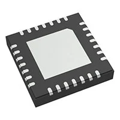
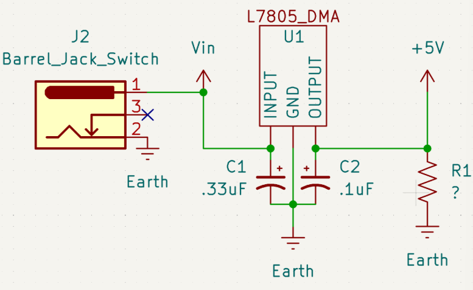

## Module's Major Components Selection Process

### Power Management

| **Solution**                                                                                                                                                                                      | **Pros**                                                                                                                                    | **Cons**                                                                                            |
| ------------------------------------------------------------------------------------------------------------------------------------------------------------------------------------------------- | ------------------------------------------------------------------------------------------------------------------------------------------- | -------------------------------------------------------
|
|  Option 1.  TPSM84209RKHR $5/each [link to product](https://www.digikey.com/en/products/detail/texas-instruments/TPSM84209RKHR/10273205?s=N4IgTCBcDaICoAUDKBZAHAFjABgJwCUBpACXxAF0BfIA)                 | \* Input 4.5-28V  \* Fixed 3.3/5V output  \* 2A output  \*  | \* Requires 2-3 external capcitors |
 Option 2.   MAX20457ATIF  $6/each [Link to product](https://www.digikey.com/en/products/detail/analog-devices-inc-maxim-integrated/MAX20457ATIF-VY/11484961) | \* Smaller component  \* Only one IC   \* Input 3.5-36V output 3.3/5V | \* Needs external inductors and capacitors  \* More succeptible to overheating    | 
 Option 3.  LM7805 $0.50/each   [Link to product](https://www.digikey.com/en/products/detail/stmicroelectronics/L7805CV/585964) | \* Components are readily available  \* Able to switch from load and no load  |  \* Requires multiple parts  \* Takes up greater space  \* Components are susceptible to heating    |

**Choice:** Option 3: LDC1101DRCR

**Rationale:** Despite being more complicated than the JDC1614RGHR, both would require a custom coil design and a PCB layout to apply which would require research to use either parts. But the LDC1101DRCR has higher processing abilities and an available datasheet.

### Sensor
| **Solution**                                                                                                                                                                                      | **Pros**                                                                                                                                    | **Cons**                                                                                            |
| ------------------------------------------------------------------------------------------------------------------------------------------------------------------------------------------------- | ------------------------------------------------------------------------------------------------------------------------------------------- | -------------------------------------------------------
|
|  Option 1.  JDC1614RGHR $5/each [link to product](https://www.digikey.com/en/products/detail/texas-instruments/LDC1614RGHR/5481860)                 | \* 3.3V power consumption \* Immune to environmental contaminants \* Contactless sensing   | \* Requires I2C configuration  \* Sensor coil must be designed |
 Option 2.   LJ12A3-4-Z  $10/each [Link to product](https://www.amazon.com/LJ12A3-4-Z-Inductive-Proximity-Printer-Leveling/dp/B07XGFTV2F) | \* 3 wire connection  \* *detects conductors, liquids, and powders |   \* Requires 5V\* No datasheet  \* From Amazon   | 
 Option 3.  LDC1101DRCR $4/each   [Link to product](https://https://www.digikey.com/en/products/detail/texas-instruments/LDC1101DRCR/8347716) | \* Measures both inductance and proximity profiling path  \* Higher speeds and resolution than the JDC1614  |  \* Sensor coil must be designed  \* SPI programming required  \* More complex to implement    |

**Choice:** Option 3: LDC1101DRCR

**Rationale:** Despite being more complicated than the JDC1614RGHR, both would require a custom coil design and a PCB layout to apply which would require research to use either parts. But the LDC1101DRCR has higher processing abilities and an available datasheet.
