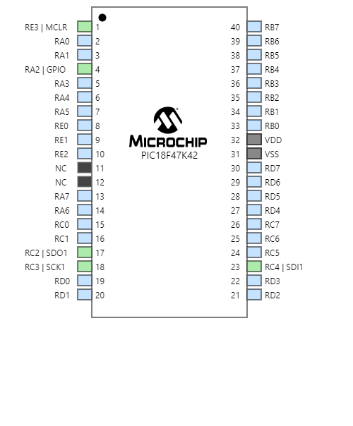

| PIC Info                                      | Answer | Help                                                                                                      |
| --------------------------------------------- | ------ | --------------------------------------------------------------------------------------------------------- |
| Model                                         | PIC18F47Q10-I/P      | 8-bit PIC18 MCU           |
| Product Page URL                              |       | [link](https://www.digikey.com/en/products/detail/microchip-technology/pic18f47q10-i-p/10187785)                                              |
| Datasheet URL(s)                              |       | [link](https://ww1.microchip.com/downloads/en/DeviceDoc/PIC18F27-47Q10-Data-Sheet-40002043E.pdf)                                              |
| Application Notes URL(s)                      |       | [link](https://ww1.microchip.com/downloads/en/DeviceDoc/PIC18F2X_4XQ10-Prod-Brief-40001920C.pdf)                                              |
| Vendor link                                   |       | [link](https://www.digikey.com/en/products/detail/microchip-technology/pic18f47q10-i-p/10187785)                        |
| Code Examples                                 |       | url(s) for libraries on github or other sites related to the microcontroller and your planned peripherals |
| External Resources URL(s)                     |       | Search on Google and YouTube for other resources for each specific microcontroller.                       |
| Unit cost                                     | $2.52      | Found on Digikey                                                            |
| Absolute Maximum Current for entire IC        | 95mA      | Find in the microcontroller datasheet                                                                     |
| Supply Voltage Range                          | 1.8V - 5.5V; 3.3V/5V; 6.5V      | Min / Nominal / Max / Absolute Max, as found in datasheet                                                 |
| Absolute Maximum current   (for entire IC) | 95mA      | as found in datasheet                                                                                     |
| Maximum GPIO current   (per pin)           | 25mA      | as found in datasheet                                                                                     |
| Supports External Interrupts?                 | Yes      | as found in datasheet                                                                                     |
| Required Programming Hardware, Cost, URL      | MPLAB      | found on the microcontroller's product page                                                               |
| Works with MPLabX?                            | Yes      | Required.  See [Microchip Development Tools](https://www.microchip.com/development-tools)                 |
| Works with Microchip Code Configurator?       | Yes      | Can be validated in MPLabX.  Screenshot required.                                                         |

## MCC Configuration

| Module | # Available | Needed | Associated Pins (or * for any) |
| ---------- | ----------- | ------ | ------------------------------ |
| GPIO       | Up to 36 I/O | 9-12  | PPS                            |
| ADC        | 35          | 1      | ANx pins                       |
| UART       | 1           | 1      | PPS                            |
| SPI        | 1           | 1      | PPS                            |
| I2C        | 1           | 0      | PPS                            |
| PWM        | 4 CCP + 2 ECCP | 0   | CCPx                           |
| ICSP       | 1           | 1      | MCLR/VPP, PGC, PGD             |

